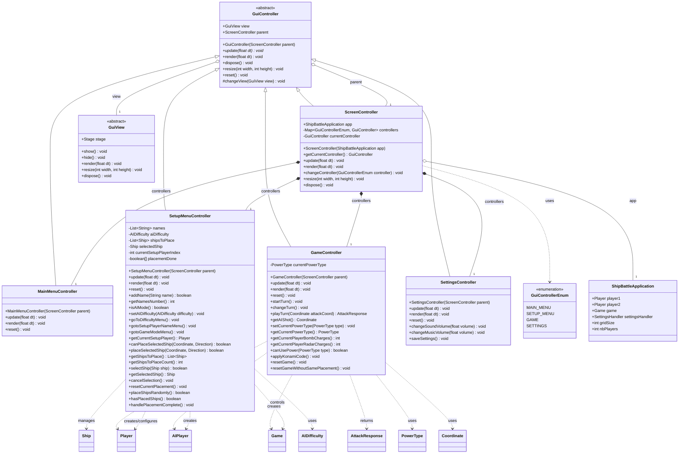

# ShipBattle - Diagramme de Classes (Contrôleurs GUI)



## Architecture des Contrôleurs

### Pattern utilisé : **State Pattern** via ScreenController

Le `ScreenController` agit comme un gestionnaire d'états qui :
1. Maintient une map de tous les contrôleurs disponibles
2. Permet la navigation entre les écrans via `changeController()`
3. Délègue le rendu et les événements au contrôleur actif

### Flux de navigation

```
┌─────────────────┐
│  MainMenuController  │
│  (MainMenuView)      │
└────────┬────────┘
         │
         ▼
┌─────────────────┐     ┌─────────────────┐
│ SetupMenuController │────▶│ SettingsController │
│ - GameModeView      │     │ (SettingsView)     │
│ - DifficultyView    │     └─────────────────┘
│ - SetupPlayerNameView│
│ - SetupPlayerShipView│
└────────┬────────┘
         │
         ▼
┌─────────────────┐
│  GameController      │
│ - GameTurnDisplayView│
│ - GameView           │
│ - AIGameView         │
│ - GameOverView       │
└─────────────────┘
```

### Responsabilités

| Contrôleur | Responsabilité |
|------------|----------------|
| `ScreenController` | Gestion des écrans, navigation, cycle de vie |
| `MainMenuController` | Affichage menu principal, musique |
| `SetupMenuController` | Configuration partie, noms, difficulté IA, placement navires |
| `GameController` | Logique de jeu, tours, attaques, pouvoirs, fin de partie |
| `SettingsController` | Volume son/musique, sauvegarde préférences |

### Légende

| Symbole | Visibilité |
|---------|------------|
| `+` | public |
| `-` | private |
| `#` | protected |

| Relation | Signification |
|----------|---------------|
| `--\|>` | Héritage (extends) |
| `*--` | Composition |
| `o--` | Agrégation |
| `..>` | Dépendance |

## Couleurs 

| Couleur       | Classe(s)                                         | Justification            |
  |---------------|---------------------------------------------------|--------------------------|
| 🔵 Bleu foncé | GuiController                                     | Classe abstraite de base |
| 🔷 Bleu clair | ScreenController                                  | Gestionnaire central     |
| 🟢 Vert       | MainMenuController                                | Point d'entrée           |
| 🟡 Jaune      | SetupMenuController                               | Configuration/Setup      |
| 🔴 Rouge      | GameController                                    | Logique de jeu (action)  |
| 🟣 Violet     | SettingsController                                | Paramètres               |
| ⚪ Gris        | GuiControllerEnum, GuiView, ShipBattleApplication | Classes externes/enum    |
