# ShipBattle - Diagramme de Classes (Vues GUI)

```mermaid
classDiagram
    direction TB

    %% ==================== GUI VIEW (ABSTRACT) ====================
    class GuiView~T~ {
        <<abstract>>
        #Texture backgroundTexture
        #ScreenController parent
        +Stage stage
        #Skin skin
        #Array~TextButton~ menuButtons
        ~float base
        #T controller
        +GuiView(ScreenController parent)
        +GuiView(ScreenController parent, T controller)
        #initUI() void
        #loadTextures() void
        #buildUI() void
        #addMenuButton(Table, String, Runnable) Cell~TextButton~
        +show() void
        +resize(int width, int height) void
        #getBaseSize() float
        +update(float delta) void
        +render(float delta) void
        +pause() void
        +resume() void
        +hide() void
        +dispose() void
    }

    %% ==================== MAIN MENU VIEW ====================
    class MainMenuView {
        -Label titleLabel
        -Label versionLabel
        -TextureRegionDrawable logoTexture
        +MainMenuView(ScreenController parent)
        #loadTextures() void
        #buildUI() void
        +resize(int width, int height) void
        +dispose() void
    }

    %% ==================== GAME MODE VIEW ====================
    class GameModeView {
        -Label titleLabel
        +GameModeView(ScreenController parent, SetupMenuController controller)
        #buildUI() void
        +resize(int width, int height) void
    }

    %% ==================== DIFFICULTY VIEW ====================
    class DifficultyView {
        -Label titleLabel
        +DifficultyView(ScreenController parent, SetupMenuController controller)
        #buildUI() void
        -gotoSetupPlayerNameMenu(AIDifficulty difficulty) void
        +resize(int width, int height) void
    }

    %% ==================== SETUP PLAYER NAME VIEW ====================
    class SetupPlayerNameView {
        -Label titleLabel
        -TextField nameField
        -int iPlayer
        +SetupPlayerNameView(ScreenController parent, SetupMenuController controller)
        #buildUI() void
        ~updateUI() void
        +update(float delta) void
        -addName() void
        +resize(int width, int height) void
        +dispose() void
    }

    %% ==================== SETUP PLAYER SHIP VIEW ====================
    class SetupPlayerShipView {
        -Table root
        -Table leftPanel
        -VerticalGroup shipListGroup
        -Table gridTable
        -Stack[][] cellStacks
        -Image[][] highlightLayers
        -Label titleLabel
        -Label instructionLabel
        -Label directionLabel
        -Label helperLabel
        -TextButton readyButton
        -TextButton resetButton
        -TextButton cancelSelectionButton
        -TextButton randomButton
        -Direction placementDirection
        -Coordinate lastHoveredCell
        -TextureRegionDrawable gridCaseDrawable
        -TextureRegionDrawable carrierTexture
        -TextureRegionDrawable cruiserTexture
        -TextureRegionDrawable destroyerTexture
        -TextureRegionDrawable torpedoTexture
        -Texture highlightTexture
        -Cursor customCursor
        +SetupPlayerShipView(ScreenController parent, SetupMenuController controller)
        #loadTextures() void
        #buildUI() void
        -buildGrid() void
        -refreshShipList() void
        -refreshPlacedShips() void
        -handleShipSelection(Ship, TextButton) boolean
        -handleReadyButton() void
        -handleResetPlacement() void
        -handleCancelSelection() void
        -handleRandomPlacement() void
        -handleHover(int x, int y) void
        -clearHover() void
        -attemptPlacement(int x, int y) void
        -toggleDirection() void
        +resize(int width, int height) void
        +dispose() void
    }

    %% ==================== GAME VIEW ====================
    class GameView {
        #Stack rootStack
        #Stack trackingTableStack
        #Stack snipeStack
        #Stack bombStack
        #Stack radarStack
        #Stack[][] trackingTableChildStacks
        +Table trackingTable
        +Table shipTable
        #Table root
        #Table pauseTable
        #List~Label~ headerLabels
        #List~Label~ rowLabels
        #Label loliMsg
        #Label coordLabel
        #Label pauseTitleLabel
        #Label turnLabel
        #Label nameLabel
        #Image pauseImage
        #Image loliImage
        #Image radarAnimImage
        #TextureRegionDrawable gridCaseTexture
        #TextureRegionDrawable snipeTexture
        #TextureRegionDrawable carrierTexture
        #TextureRegionDrawable cruiserTexture
        #TextureRegionDrawable destroyerTexture
        #TextureRegionDrawable torpedoTexture
        #TextureRegionDrawable missTexture
        #TextureRegionDrawable hitTexture
        #TextureRegionDrawable sunkTexture
        #TextureRegionDrawable loliTexture
        #TextureRegionDrawable pauseTexture
        #TextureRegionDrawable radarTexture
        #TextureRegionDrawable bombTexture
        #Animation~TextureRegion~ loliAnimation
        #Animation~TextureRegion~ radarFoundAnimation
        #Animation~TextureRegion~ radarNothingAnimation
        #Player currentPlayer
        #AttackResponse response
        #boolean turnPlayed
        #boolean shoot
        #boolean launchRadarAnimation
        #boolean paused
        #float waitTimer
        #float dialogTimer
        #float radarTimer
        +GameView(ScreenController parent, GameController controller)
        #loadTextures() void
        #buildUI() void
        #buildStatusGroup() void
        #buildPowerGroup(HorizontalGroup powerGroup) void
        #createPowerStack(TextureRegionDrawable, int) Stack
        #buildPlayerGridsUI() void
        #buildFooter() void
        ~updateTableWithModel(Table, Grid, boolean, boolean) Stack[][]
        ~playDialog(DialogID, float) void
        +update(float delta) void
        #updateRadarAnimation() void
        #updateDialogAnimation() void
        #updateUIOnAttack() void
        #applyKonamiCode() void
        +render(float delta) void
        +resize(int width, int height) void
        #getShipDrawable(String shipName) TextureRegionDrawable
        #updatePlayerTables() void
        #togglePause() void
        +dispose() void
    }

    %% ==================== AI GAME VIEW ====================
    class AIGameView {
        #Stack oldPos
        #float waitAITimer
        #Random random
        +AIGameView(ScreenController parent, GameController controller)
        #buildPlayerGridsUI() void
        #updatePlayerTables() void
        +update(float delta) void
    }

    %% ==================== GAME TURN DISPLAY VIEW ====================
    class GameTurnDisplayView {
        -Label msg
        -Player currentPlayer
        +GameTurnDisplayView(ScreenController parent, GameController controller)
        #buildUI() void
        +resize(int width, int height) void
    }

    %% ==================== GAME OVER VIEW ====================
    class GameOverView {
        -Label msg
        -Player winner
        +GameOverView(ScreenController parent, GameController controller)
        #buildUI() void
        +resize(int width, int height) void
    }

    %% ==================== SETTINGS VIEW ====================
    class SettingsView {
        -Label titleLabel
        -Label soundVolumeLabel
        -Label musicVolumeLabel
        -VisSlider soundVolumeSlider
        -VisSlider musicVolumeSlider
        -SettingsHandler data
        +SettingsView(ScreenController parent, SettingsController controller)
        #buildUI() void
        +resize(int width, int height) void
    }

    %% ==================== HANDLERS ====================
    class Handler {
        <<interface>>
        +dispose() void
    }

    class SpriteHandler {
        -Texture[] textures$
        -Animation~TextureRegion~[] animations$
        +SpriteHandler()
        +loadContent() void
        +getTexture(TextureID textureID)$ Texture
        +getAnimation(AnimationID animationID)$ Animation~TextureRegion~
        +getShipByName(String shipName)$ Texture
        +dispose() void
    }

    class SoundHandler {
        -Sound[] sounds$
        -Music[] tracks$
        ~Music currentTrack$
        +SoundHandler()
        +loadContent() void
        +playSound(SoundID sound, float volume)$ void
        +playTrack(TrackID track, float volume, boolean loop)$ void
        +dispose() void
    }

    class DialogHandler {
        -String dialogText$
        -float dialogDuration$
        +playDialog(DialogID dialogID, float duration)$ void
        +getCharCountThisFrame(float elapsed)$ int
        +getDialogDuration()$ float
        +getDialogText()$ String
        +dispose() void
    }

    class InputHandler {
        ~Vector2 touchPos$
        ~List~Integer~ lastKeys$
        ~int[] konamiCode$
        +InputHandler()
        +userJustTouched()$ boolean
        +getTouchPos(Viewport viewport)$ Vector2
        +isKeyJustPressed(int keyCode)$ boolean
        +saveUserPressedKey(int keyCode)$ void
        +konamiCodeJustPressed()$ boolean
        +clearSaveKeys()$ void
        +dispose() void
    }

    class SettingsHandler {
        -float soundVolume
        -float musicVolume
        +SettingsHandler()
        +getSoundVolume() float
        +setSoundVolume(float soundVolume) void
        +getMusicVolume() float
        +setMusicVolume(float musicVolume) void
        +loadSettings() void
        +saveSettings() void
        +dispose() void
    }

    %% ==================== ENUMS ====================
    class TextureID {
        <<enumeration>>
        BACKGROUND
        GRID_CASE
        CARRIER
        CRUISER
        DESTROYER
        TORPEDO
        SNIPE
        MISS
        HIT
        SUNK
        PAUSE_BACKGROUND
        LOGO
        RADAR
        BOMB
    }

    class AnimationID {
        <<enumeration>>
        LOLI
        RADAR_NOTHING
        RADAR_FOUND
    }

    class SoundID {
        <<enumeration>>
        ERROR
        CANNON_SHOT
        HIT
        MISS
        SUNK
        ALREADY_HIT
        RADAR_NOTHING
        RADAR_FOUND
        BOMB_SHOT
        CHEAT_CODE
    }

    class TrackID {
        <<enumeration>>
        MENU_THEME
        GAME_THEME
    }

    class DialogID {
        <<enumeration>>
        TURN_START
        MISS
        HIT
        SUNK
        ALREADY_HIT
        TURN_START_AI
        RADAR_SELECTED
        RADAR_NOTHING
        RADAR_FOUND
        UNAVAILABLE_POWER
        BOMB_SELECTED
        BOMB_SHOT
        KONAMI_CODE
    }

    %% ==================== EXTERNAL (simplified) ====================
    class Screen {
        <<interface>>
        +show() void
        +render(float delta) void
        +resize(int width, int height) void
        +pause() void
        +resume() void
        +hide() void
        +dispose() void
    }

    class ScreenController {
        +ShipBattleApplication app
        +changeController(GuiControllerEnum controller) void
    }

    %% ==================== RELATIONS ====================

    %% Interface implementation
    GuiView~T~ ..|> Screen

    %% Inheritance - Views
    MainMenuView --|> GuiView~T~ : T=MainMenuController
    GameModeView --|> GuiView~T~ : T=SetupMenuController
    DifficultyView --|> GuiView~T~ : T=SetupMenuController
    SetupPlayerNameView --|> GuiView~T~ : T=SetupMenuController
    SetupPlayerShipView --|> GuiView~T~ : T=SetupMenuController
    GameView --|> GuiView~T~ : T=GameController
    AIGameView --|> GameView
    GameTurnDisplayView --|> GuiView~T~ : T=GameController
    GameOverView --|> GuiView~T~ : T=GameController
    SettingsView --|> GuiView~T~ : T=SettingsController

    %% Handler interface implementation
    SpriteHandler ..|> Handler
    SoundHandler ..|> Handler
    DialogHandler ..|> Handler
    InputHandler ..|> Handler
    SettingsHandler ..|> Handler

    %% Handler nested enums
    SpriteHandler *-- TextureID
    SpriteHandler *-- AnimationID
    SoundHandler *-- SoundID
    SoundHandler *-- TrackID
    DialogHandler *-- DialogID

    %% GuiView dependencies
    GuiView~T~ o-- ScreenController : parent
    GuiView~T~ ..> SpriteHandler : uses

    %% View dependencies on handlers
    GameView ..> SoundHandler : plays sounds
    GameView ..> DialogHandler : displays dialogs
    GameView ..> InputHandler : handles input
    SettingsView ..> SoundHandler : previews audio
    SettingsView o-- SettingsHandler : data
```



## Architecture des Vues

### Pattern utilisé : **Template Method Pattern** via GuiView

La classe `GuiView<T>` définit un squelette pour toutes les vues :
1. `initUI()` - Initialise les composants de base (Stage, Skin)
2. `loadTextures()` - Charge les textures nécessaires
3. `buildUI()` - Construit l'interface utilisateur
4. `resize()` - Adapte l'UI à la taille de l'écran

### Hiérarchie des Vues

```
┌──────────────────────────────────────────────────────────────┐
│                      GuiView<T> (abstract)                   │
│                   implements LibGDX Screen                   │
└─────────────────────────┬────────────────────────────────────┘
                          │
        ┌─────────────────┼─────────────────┐
        │                 │                 │
        ▼                 ▼                 ▼
┌───────────────┐ ┌───────────────┐ ┌───────────────┐
│ MainMenuView  │ │  SettingsView │ │ Setup Views   │
│               │ │               │ │ - GameModeView│
└───────────────┘ └───────────────┘ │ - Difficulty  │
                                    │ - PlayerName  │
                                    │ - PlayerShip  │
                                    └───────────────┘
                                           │
                          ┌────────────────┼────────────────┐
                          │                │                │
                          ▼                ▼                ▼
                   ┌───────────────┐ ┌──────────┐ ┌──────────────┐
                   │   GameView    │ │ TurnView │ │ GameOverView │
                   │               │ │          │ │              │
                   └───────┬───────┘ └──────────┘ └──────────────┘
                           │
                           ▼
                   ┌───────────────┐
                   │  AIGameView   │
                   │ (hérite de    │
                   │  GameView)    │
                   └───────────────┘
```

### Handlers (Utilitaires statiques)

| Handler | Responsabilité |
|---------|----------------|
| `SpriteHandler` | Chargement et accès aux textures et animations |
| `SoundHandler` | Lecture des sons et musiques |
| `DialogHandler` | Gestion des dialogues textuels animés |
| `InputHandler` | Gestion des entrées (clavier, souris, Konami Code) |
| `SettingsHandler` | Persistance des préférences utilisateur |

### Responsabilités des Vues

| Vue | Responsabilité |
|-----|----------------|
| `MainMenuView` | Menu principal avec logo, boutons New Game/Settings/Quit |
| `GameModeView` | Sélection du mode : PvP ou PvIA |
| `DifficultyView` | Sélection de la difficulté IA |
| `SetupPlayerNameView` | Saisie des noms des joueurs |
| `SetupPlayerShipView` | Placement interactif des navires sur la grille |
| `GameTurnDisplayView` | Écran de transition entre les tours |
| `GameView` | Interface de jeu principale (grilles, pouvoirs, dialogues) |
| `AIGameView` | Variante de GameView pour le mode IA (une seule grille) |
| `GameOverView` | Écran de fin avec options Retry/Menu |
| `SettingsView` | Réglages audio (sliders volume) |

## Légende

### Visibilité des membres

| Symbole | Visibilité |
|---------|------------|
| `+` | public |
| `-` | private |
| `#` | protected |
| `~` | package |
| `$` | static |

### Relations entre classes

| Symbole | Signification |
|---------|---------------|
| `*--` | Composition |
| `o--` | Agrégation |
| `..>` | Dépendance |
| `--|>` | Héritage (extends) |
| `..\|>` | Implémentation (implements) |

## Couleurs proposées

| Couleur | Classe(s) | Justification |
|---------|-----------|---------------|
| 🔵 **Bleu foncé** | `GuiView<T>` | Classe abstraite de base |
| 🟢 **Vert** | `MainMenuView` | Point d'entrée |
| 🟡 **Jaune** | `GameModeView`, `DifficultyView`, `SetupPlayerNameView`, `SetupPlayerShipView` | Écrans de configuration |
| 🔴 **Rouge** | `GameView`, `AIGameView` | Écrans de jeu principal |
| 🟠 **Orange** | `GameTurnDisplayView`, `GameOverView` | Écrans de transition |
| 🟣 **Violet** | `SettingsView` | Paramètres |
| 🔷 **Bleu clair** | `SpriteHandler`, `SoundHandler`, `DialogHandler`, `InputHandler`, `SettingsHandler` | Handlers utilitaires |
| ⚪ **Gris** | Enums (`TextureID`, `SoundID`, etc.) | Types énumérés |
