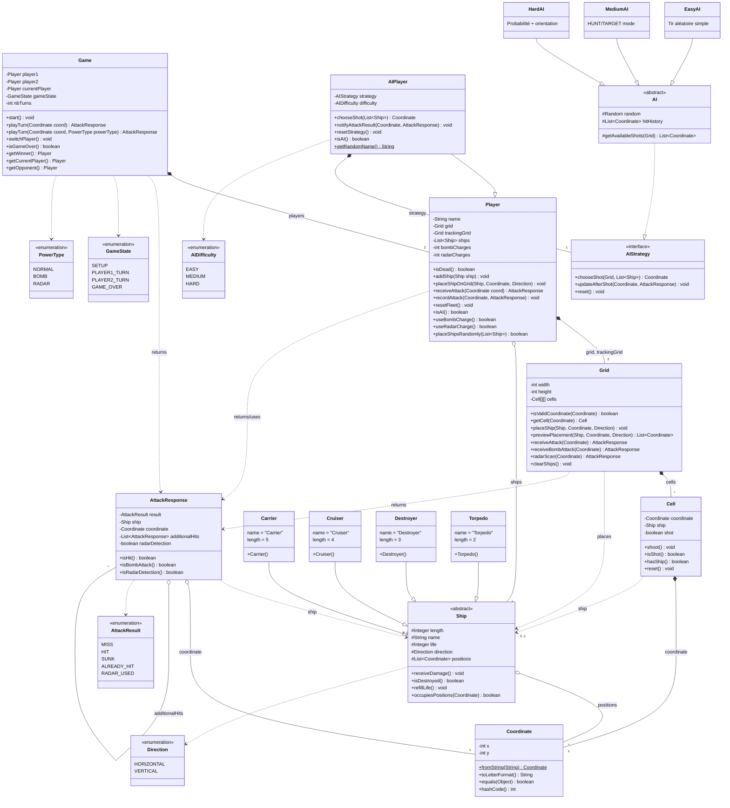

# ShipBattle - Diagramme de Classes (Modèles)

## Légende

### Visibilité des membres

| Symbole | Visibilité | Description |
|---------|------------|-------------|
| `+` | public | Accessible partout |
| `-` | private | Accessible uniquement dans la classe |
| `#` | protected | Accessible dans la classe et ses sous-classes |
| `~` | package | Accessible dans le même package |

### Relations entre classes

| Symbole | Signification |
|---------|---------------|
| `*--` | Composition (le conteneur possède et gère le cycle de vie) |
| `o--` | Agrégation (le conteneur référence mais ne possède pas) |
| `-->` | Association |
| `..>` | Dépendance |
| `--\|>` | Héritage (extends) |
| `..\|>` | Implémentation (implements) |

## Classes par couleur (dans draw.io)

| Couleur | Type |
|---------|------|
| 🔵 Bleu | Classes de jeu (Game, AttackResponse) |
| 🟢 Vert | Player |
| 🟡 Jaune | IA (AIPlayer, AIStrategy, AI, EasyAI, MediumAI, HardAI) |
| 🟣 Violet | Grid |
| 🔴 Rouge | Cell |
| 🟠 Orange | Ship et sous-classes |
| ⚪ Gris | Enums et Coordinate |