# Concept général

**Nom du jeu** : ShipBattle  
**Genre** : Stratégie / Tour par tour  
**Plateformes** : PC  
**Version** : 1.0.0  

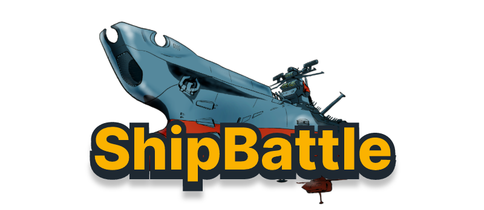

## Pitch

Deux joueurs s'affrontent en plaçant leurs navires sur une grille.
Chaque joueur tente de toucher et couler les navires adverses en alternant les tirs. Le premier à couler tous les navires de l'autre remporte la partie.

# Gameplay

## Mécaniques principales

- Chaque joueur dispose d'une grille 10x10.
- Les joueurs placent leurs navires (de différents types explicités plus bas) sur leur grille.
- Les navires ne peuvent pas se toucher (zone tampon d'une case autour de chaque navire).
- Les joueurs tirent à tour de rôle sur une case ennemie.
- La partie se termine lorsqu'un joueur perd tous ses navires.

## Modes de jeu

### Joueur vs IA
Le joueur affronte une intelligence artificielle avec trois niveaux de difficulté :

- **Facile** : L'IA tire de manière aléatoire sur les cases non encore ciblées.
- **Moyen** : L'IA utilise un système de modes HUNT/TARGET. En mode HUNT, elle tire aléatoirement. Après un tir réussi, elle passe en mode TARGET et cible les cases adjacentes (haut, bas, gauche, droite) jusqu'à couler le navire.
- **Difficile** : L'IA utilise une carte de densité de probabilité pour calculer les positions optimales. Elle analyse l'orientation des navires touchés (horizontal/vertical) et utilise un pattern en damier pour optimiser la recherche.

### Joueur vs Joueur
Deux joueurs humains s'affrontent en alternant les tours.

## Système d'attaque

### Attaque normale
- Cible une seule case
- Inflige 1 point de dégât au navire touché

### Bombe (2 charges par joueur)
- Attaque en zone 3x3 (case centrale + 8 cases adjacentes)
- Touche tous les navires dans la zone d'effet

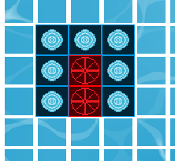

### Radar (3 charges par joueur)
- Scanne une zone 3x3
- Détecte la présence de navires sans infliger de dégâts
- Ne consomme pas le tour du joueur

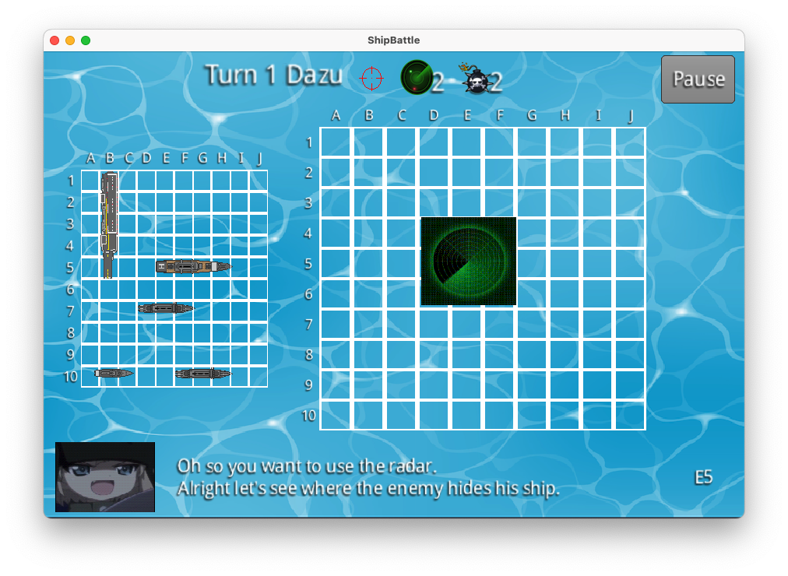

## Progression et conditions de victoire

- La partie continue jusqu'à ce qu'un joueur soit éliminé (tous ses navires coulés).
- Le nombre de tours est comptabilisé.

## Système de contrôle

- Souris pour sélectionner les cases et interagir avec l'interface
- Clavier pour la rotation des navires et les raccourcis
- Support du placement aléatoire des navires

# Personnages et unités

## Joueur
- Représente le joueur humain ou l'IA
- L'IA possède des noms générés aléatoirement : Tanya, Erza, Azusa, Rika, Kanna, Konata

## Navires

Chaque navire possède des points de vie égaux à sa longueur. Il peut être placé horizontalement ou verticalement.

| Navire            | Nom anglais | Taille  | Quantité |
|-------------------|-------------|---------|----------|
| Porte-avion       | Carrier     | 5 cases | 1        |
| Croiseur          | Cruiser     | 4 cases | 1        |
| Contre-torpilleur | Destroyer   | 3 cases | 2        |
| Torpilleur        | Torpedo     | 2 cases | 1        |

**Total** : 5 navires, 17 cases occupées

## Placement des navires

- Les navires peuvent être placés horizontalement ou verticalement
- Aucun chevauchement autorisé entre navires
- Zone tampon d'une case autour de chaque navire (les navires ne peuvent pas être adjacents)
- Validation des limites de la grille
- Prévisualisation du placement avant confirmation
- Option de placement aléatoire disponible

# Graphismes et audio

## Direction artistique
- Pas de style graphique unifié imposé
- Nombreuses références aux animés et à la pop culture
- Dialogues avec mimiques et expressions inspirées de la culture otaku
- Noms d'IA tirés de personnages d'animés (Tanya, Erza, Azusa, Rika, Kanna, Konata)

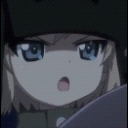

## Graphismes
- Style 2D simple et clair
- 14 sprites différents : fond, cases de grille, navires, résultats d'attaque, éléments d'interface
- Animations GIF pour les dialogues de personnage

## Sources des assets

Les assets proviennent de différentes sources open source et libres de droits :
- **Navires** : Sprites open source
- **Icônes** : Radar, bombes et éléments d'interface issus de ressources libres
- **Animations** : GIFs de personnages pour les dialogues

https://opengameart.org/content/animated-radar-assets
https://opengameart.org/content/bomb-explosion
https://opengameart.org/content/naval-battle-assets-pack
https://opengameart.org/content/sea-warfare-set-ships-and-more

## Audio

### Effets sonores
- Tir de canon
- Touché
- Manqué
- Coulé
- Case déjà touchée
- Radar (trouvé / rien trouvé)
- Tir de bombe
- Activation du code triche
- Erreur

### Musique

- Thème du menu (en boucle)
- Thème de jeu (en boucle)
- Musiques issues du jeu **Crimson Skies**
- Contrôle de volume indépendant pour les effets et la musique

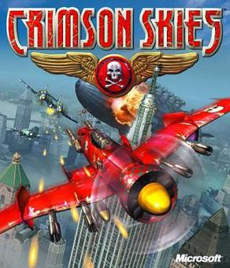

# Interface utilisateur

## Écrans

### Menu principal
- Logo du jeu
- Boutons : Nouvelle partie, Paramètres, Quitter
- Affichage de la version (v1.0.0 - 2025)

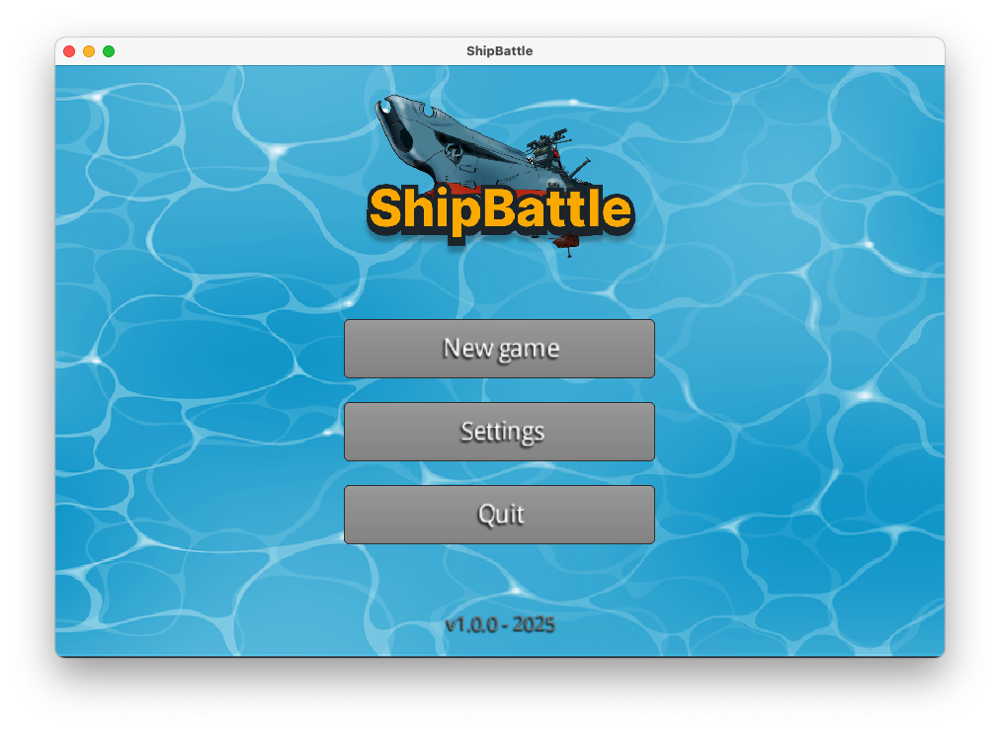

### Sélection du mode de jeu
- Joueur vs IA
- Joueur vs Joueur

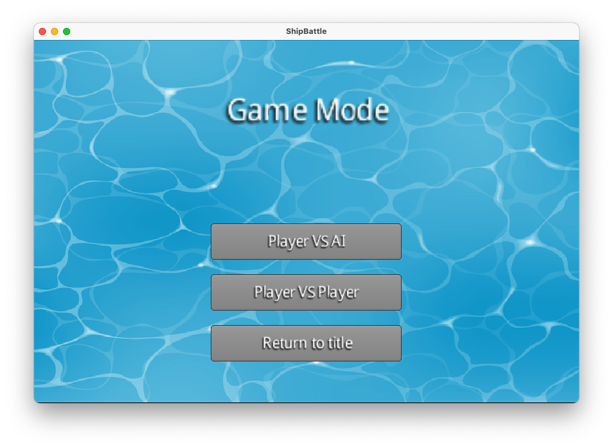

### Sélection de la difficulté (mode IA)
- Facile
- Moyen
- Difficile

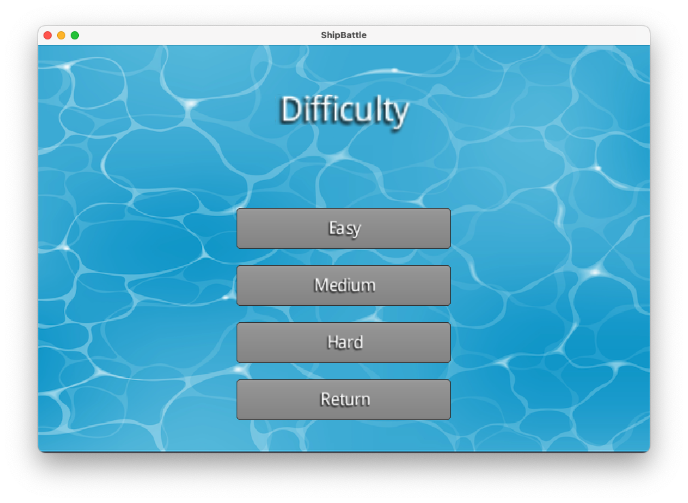

### Saisie des noms
- Champ de texte pour le nom du joueur
- Saisie séquentielle pour le mode 2 joueurs

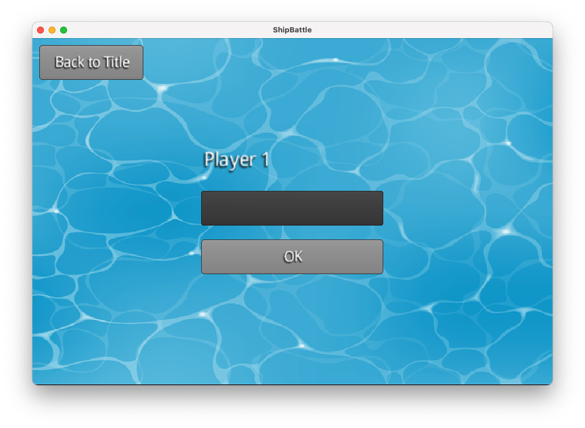

### Placement des navires

- Grille interactive avec coordonnées
- Liste des navires à placer
- Prévisualisation en temps réel (vert = valide, rouge = invalide)
- Bouton de rotation
- Option de placement aléatoire

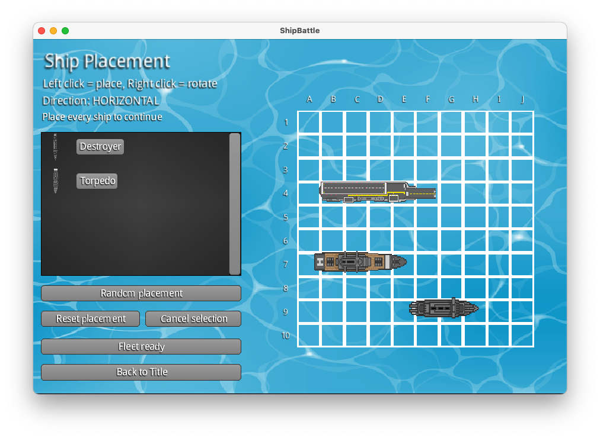

### Écran de jeu
- Grille du joueur (gauche) : navires et attaques reçues
- Grille de suivi (droite) : attaques effectuées et résultats
- Boutons de pouvoirs (Bombe, Radar) avec indicateurs de charges
- Indicateur de tour
- Animation de personnage pour les dialogues
- Fonctionnalité pause/reprise

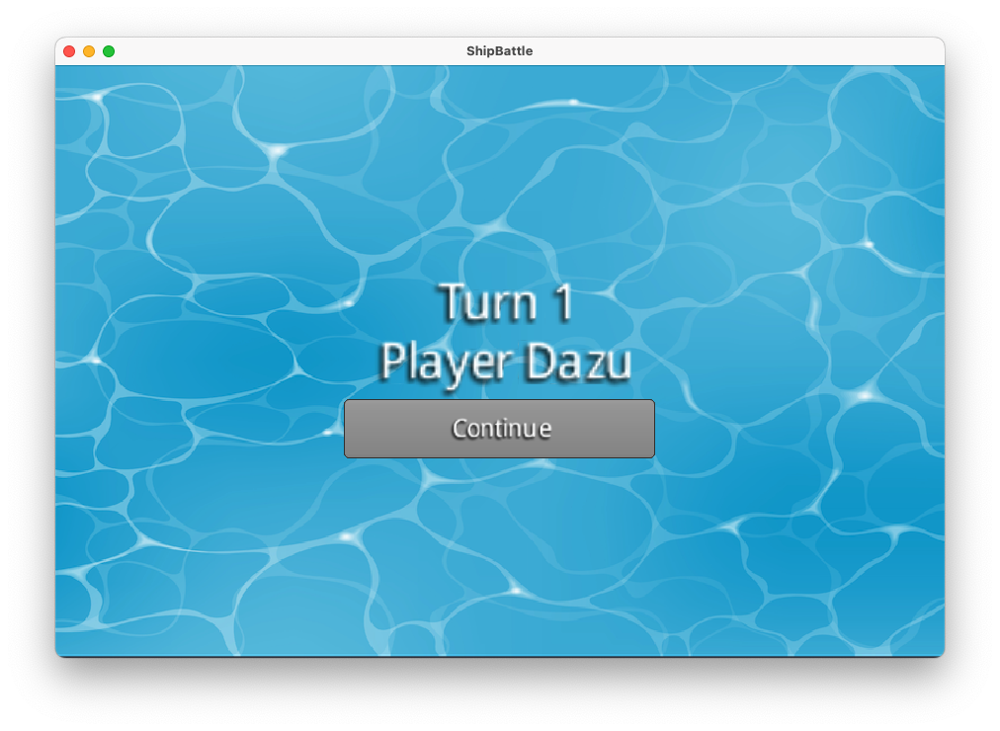

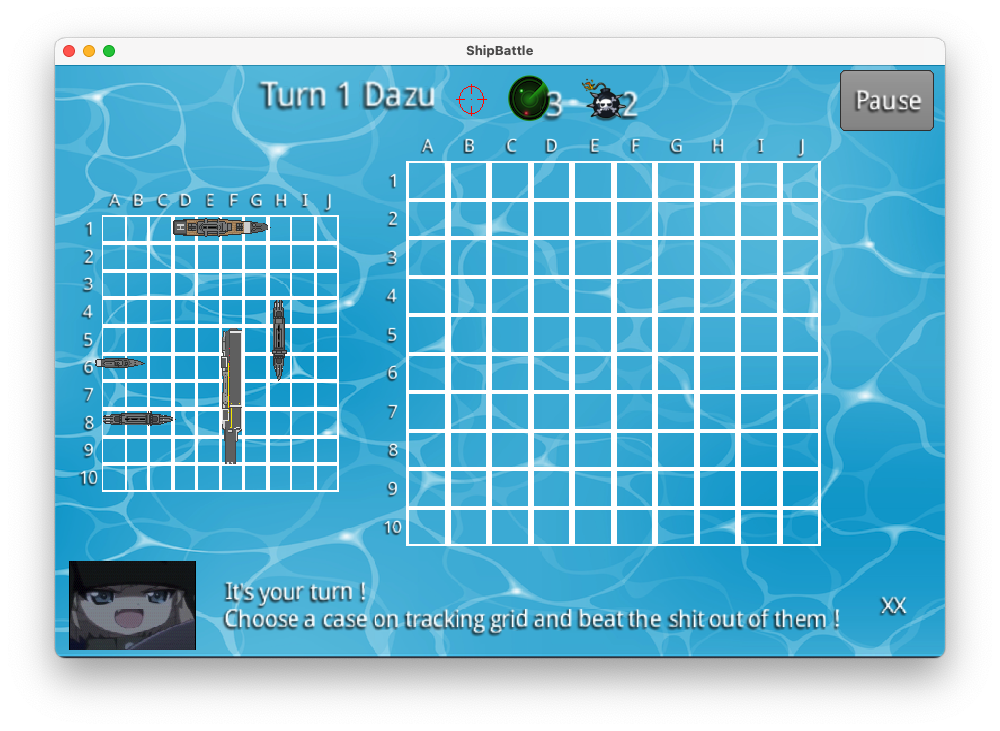

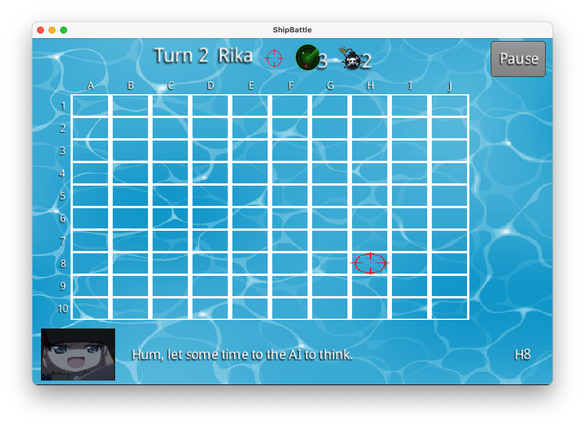

### Écran de fin de partie
- Annonce du vainqueur
- Options de replay :
  - Rejouer avec le même placement
  - Rejouer avec un nouveau placement
  - Retour au menu principal

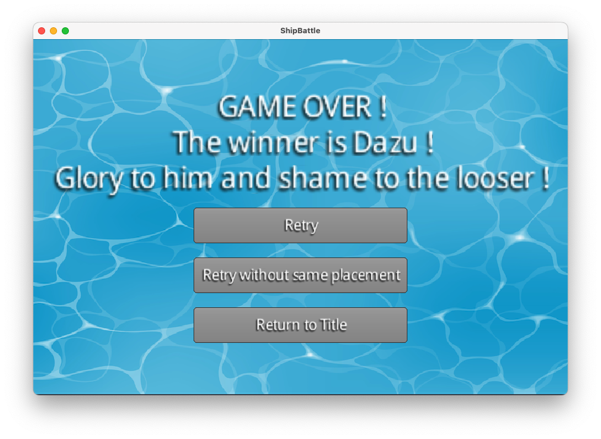

### Paramètres
- Slider volume des effets sonores (0-100%)
- Slider volume de la musique (0-100%)
- Prévisualisation audio en temps réel
- Sauvegarde des paramètres

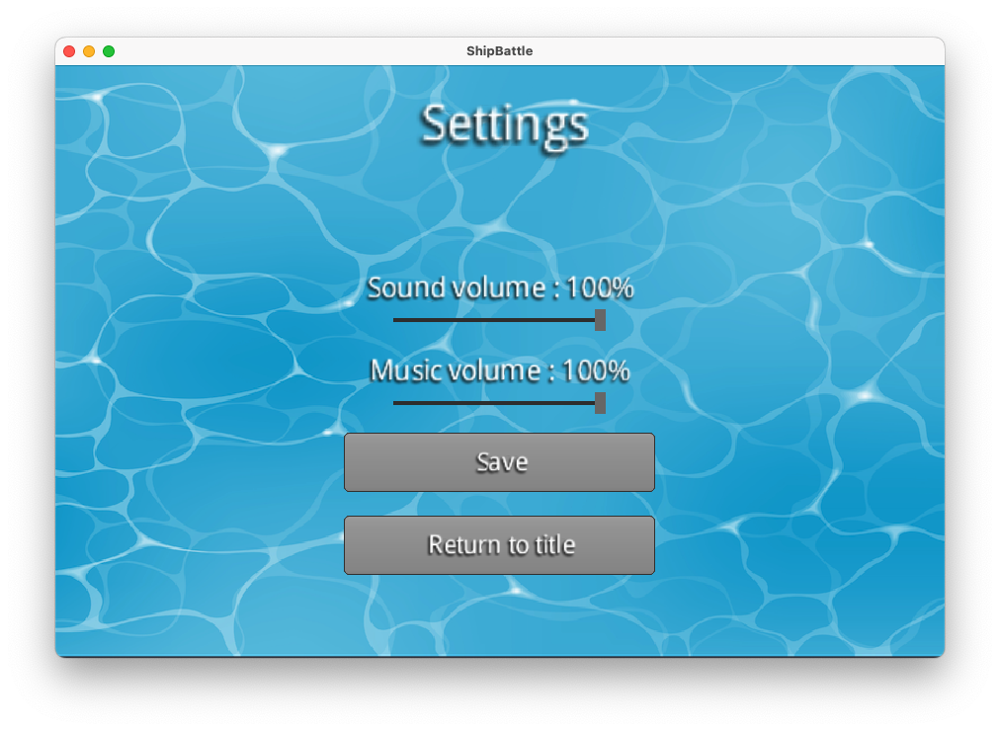

## Retours visuels

- Code couleur pour le placement (vert/rouge)
- Mise à jour en temps réel des grilles
- Indicateurs de statut pour les charges de pouvoirs
- Mise à l'échelle responsive selon la résolution

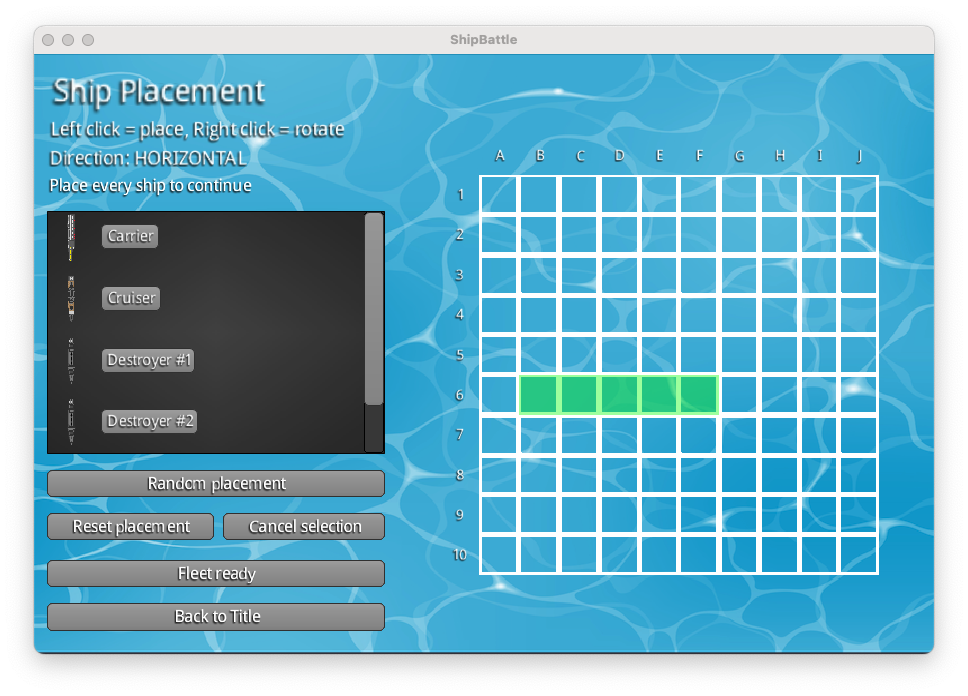
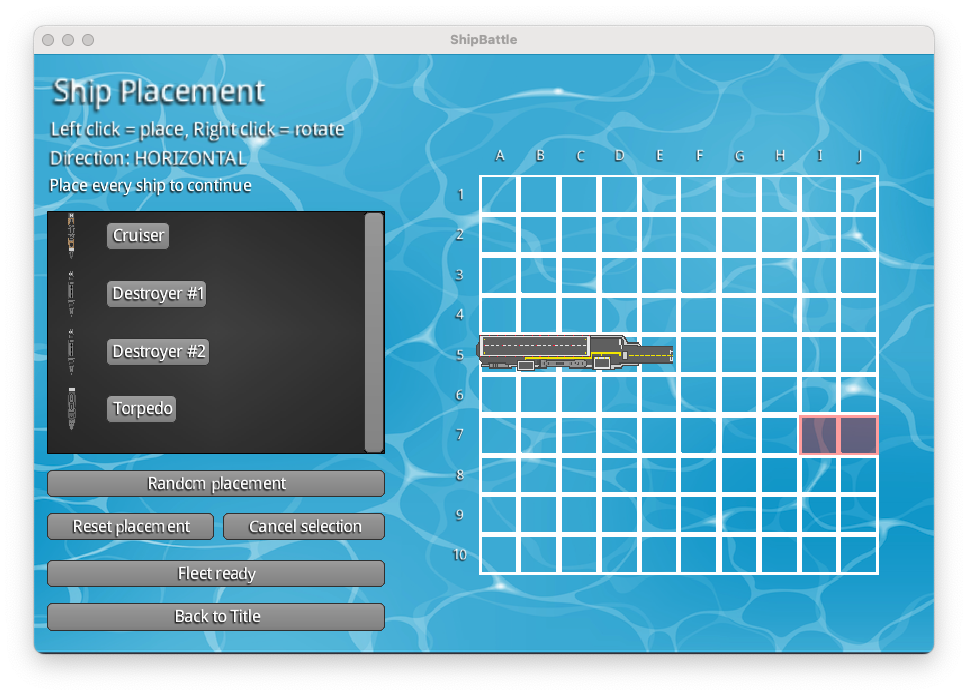

# Fonctionnalités bonus

## Système d'animation de personnage
- Animations GIF pour les dialogues et événements narratifs
- Affichage temporisé des dialogues
- Notifications visuelles pour les changements d'état du jeu

## Réponses d'attaque détaillées
- MISS : Aucun navire touché
- HIT : Navire endommagé mais pas détruit
- SUNK : Navire détruit (tous les PV épuisés)
- ALREADY_HIT : Coordonnée déjà attaquée
- RADAR_USED : Scan radar effectué

# Aspects techniques

## Stack technologique
- **Langage** : Java
- **Framework** : LibGDX
- **UI Toolkit** : Scene2D, VisUI
- **Build System** : Gradle

## Architecture
Structure du code basée sur le pattern MVC :
- **model** : Logique du jeu et modèle de données (Game, Grid, Cell, Ship, Coordinate, AttackResponse, AI)
- **view** : Interface graphique (MainMenuView, GameView, SetupPlayerShipView, etc.) et gestion audio/sprites
- **controller** : Intermédiaire entre model et view, gestion des entrées utilisateur

## Système de coordonnées
- Indexation à base zéro (0-9 pour grille 10x10)
- Formats d'entrée supportés :
  - Numérique : "3,5" (format x,y)
  - Alphanumérique : "A1", "Z10" (style Excel)

# Planification

- Phase 1 : Conception du diagramme UML et GDD ✅
- Phase 2 : Développement d'une version en terminal du jeu avec la logique de base ✅
- Phase 3 : Création de l'interface graphique et des assets ✅
- Phase 4 : Tests et ajustements ✅
- Phase 5 : Version finale et packaging ✅

# Idées pour la suite

- Rajouter une mécanique de mouvement des navires
- Rajouter des statistiques : nombre de tirs, précision, temps de jeu
- Mode multijoueur en réseau
- Nouveaux types de pouvoirs spéciaux
- Système de classement/scores
